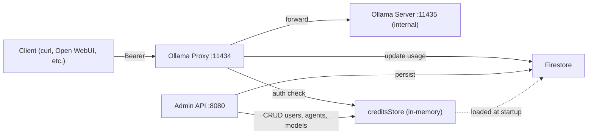
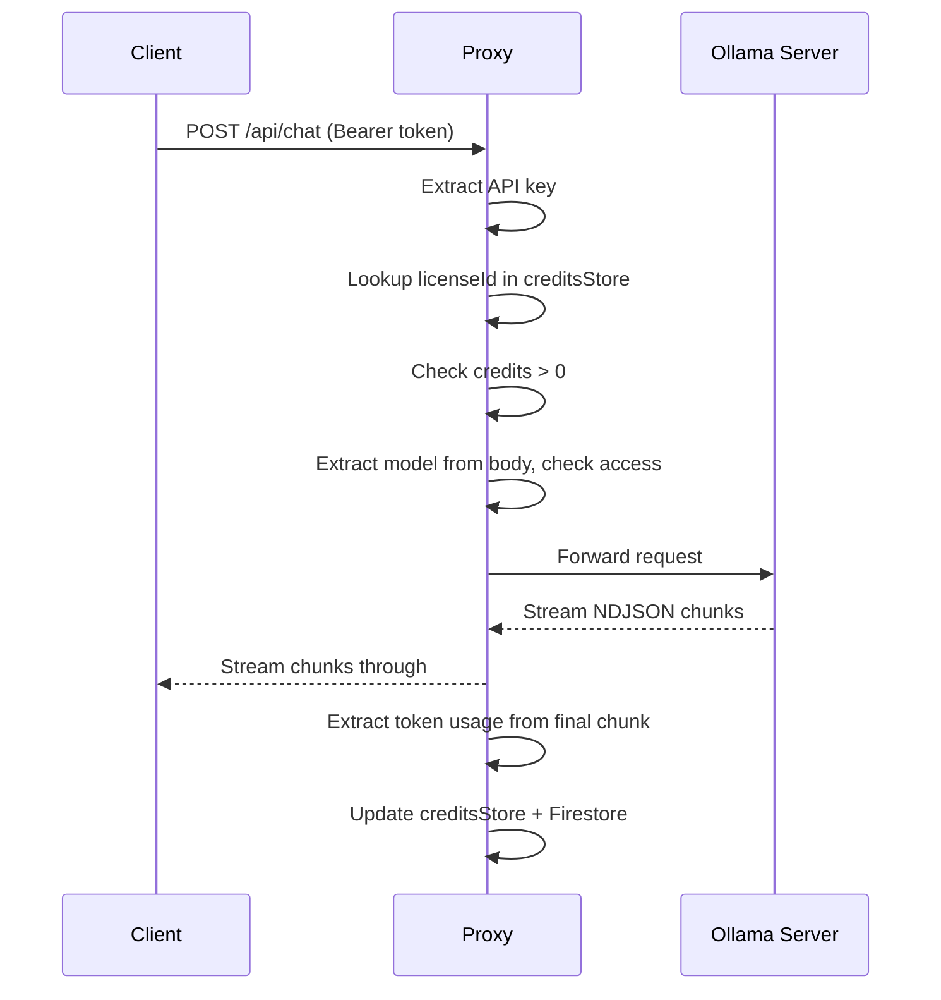

# Design Document: Ollama Proxy Auth

## Overview

This design describes an authenticated reverse proxy layer added to the easyai-gateway Go application. The proxy intercepts all external Ollama API traffic on port 11434 (configurable), authenticates requests using existing License IDs from the Credits Store, enforces per-user model access control, and forwards authorized requests to an internal Ollama server on port 11435 (configurable). The proxy runs concurrently with the existing Gin-based admin API server.

Key design decisions:
- **Separate Gin engine** for the proxy rather than adding routes to the existing admin router, because the proxy must listen on a different port and handle arbitrary Ollama paths.
- **Streaming passthrough** using `io.Copy` with flushing to support Ollama's NDJSON streaming responses without buffering.
- **In-memory credits store reuse** — the proxy reads from the same `creditsStore` map used by the admin API, avoiding duplicate Firestore reads.
- **Token extraction from final stream chunk** — Ollama includes `eval_count` and `prompt_eval_count` in the last streamed JSON object; the proxy inspects each chunk and captures usage from the final one.

## Architecture



The application starts two HTTP servers concurrently from `main()`:

1. **Admin API server** (existing) — Gin router on `SERVER_HOST:SERVER_PORT` (default `0.0.0.0:8080`)
2. **Ollama Proxy server** (new) — Gin router on `OLLAMA_PROXY_HOST:OLLAMA_PROXY_PORT` (default `0.0.0.0:11434`)

Both servers share the same `creditsStore` map (protected by a `sync.RWMutex` for concurrent access) and the same Firestore client.

### Request Flow



## Components and Interfaces

### New Files

| File | Purpose |
|------|---------|
| `ollama_proxy.go` | Proxy server setup, middleware, handlers, streaming logic |
| `agents.go` | Agent CRUD handlers and Firestore persistence |

### Key Components in `ollama_proxy.go`

1. **`StartOllamaProxy()`** — Initializes the proxy Gin engine, registers middleware and routes, starts listening. Called as a goroutine from `main()`.

2. **`OllamaProxyAuthMiddleware()`** — Gin middleware that:
   - Extracts API key from `Authorization: Bearer <key>` or `X-API-Key` header
   - Looks up the key in `creditsStore`
   - Checks available credits (`monthlyToken + topUpToken - usedToken > 0`)
   - Sets `licenseId` and `*UserCredits` in the Gin context

3. **`ModelAccessMiddleware()`** — Gin middleware that:
   - For POST requests: reads and buffers the JSON body, extracts `model` field, checks against user's `ModelAccessList`
   - For GET `/api/tags`: passes through (filtering happens in response)
   - Restores the request body for downstream handlers

4. **`ProxyHandler()`** — The catch-all handler that:
   - Builds the upstream URL from `OLLAMA_INTERNAL_URL` + original path + query
   - Copies request headers (excluding auth headers)
   - Forwards the request to Ollama
   - Streams the response back, inspecting each line for token usage
   - Updates credits after the response completes

5. **`TagsFilterHandler()`** — Specific handler for `GET /api/tags` that:
   - Forwards to Ollama, reads the full response
   - Filters the model list based on user's `ModelAccessList`
   - Returns filtered JSON

6. **`AgentsListHandler()`** — Handler for `GET /api/agents` that:
   - Returns agents filtered by user's model access

### Key Components in `agents.go`

1. **`Agent` struct** — `Name`, `Description`, `Model`, `SystemPrompt` fields
2. **`agentsStore`** — In-memory map loaded from Firestore "agents" collection at startup
3. **Admin CRUD handlers** — `CreateAgentHandler`, `DeleteAgentHandler` (PRIME_KEY protected)

### Modified Files

| File | Changes |
|------|---------|
| `main.go` | Add `go StartOllamaProxy()` call before admin server start; add agent admin routes to existing API group; add `sync.RWMutex` for `creditsStore` |
| `firestore_store.go` | Add `loadAgentsFromFirestore()`, `saveAgentToFirestore()`, `deleteAgentFromFirestore()` functions |

### Environment Variables

| Variable | Default | Description |
|----------|---------|-------------|
| `OLLAMA_PROXY_HOST` | `0.0.0.0` | Bind address for the proxy |
| `OLLAMA_PROXY_PORT` | `11434` | Port for the proxy |
| `OLLAMA_INTERNAL_URL` | `http://localhost:11435` | Internal Ollama server URL |

## Data Models

### Updated `UserCredits` struct

```go
type UserCredits struct {
    LicenseID       string   `json:"licenseId"`
    Email           string   `json:"userEmail"`
    Balance         int      `json:"monthlyToken"`
    CreditsTopup    int      `json:"topUpToken"`
    TokensUsed      int      `json:"usedToken"`
    LastUpdated     int64    `json:"lastUpdated"`
    Application     string   `json:"application"`
    ModelAccessList []string `json:"modelAccessList,omitempty"` // NEW
}
```

The `ModelAccessList` field is added to the existing struct. An empty/nil slice means "access all models." The `omitempty` tag ensures backward compatibility — existing Firestore documents without this field will deserialize with a nil slice.

### New `Agent` struct

```go
type Agent struct {
    Name         string `json:"name" firestore:"name"`
    Description  string `json:"description" firestore:"description"`
    Model        string `json:"model" firestore:"model"`
    SystemPrompt string `json:"systemPrompt" firestore:"systemPrompt"`
}
```

Stored in Firestore collection `"agents"` with `Name` as the document ID.

### Ollama Response Token Fields

The proxy inspects JSON objects in Ollama responses for these fields:

```json
{
    "eval_count": 125,
    "prompt_eval_count": 42,
    "done": true
}
```

When `done: true` is present, `eval_count + prompt_eval_count` gives total tokens used for the request.

### Credits Calculation

```
availableCredits = monthlyToken + topUpToken - usedToken
```

A request is allowed when `availableCredits > 0`. After a response, `usedToken` is incremented by `eval_count + prompt_eval_count`.

## Correctness Properties

*A property is a characteristic or behavior that should hold true across all valid executions of a system — essentially, a formal statement about what the system should do. Properties serve as the bridge between human-readable specifications and machine-verifiable correctness guarantees.*

### Property 1: API Key Extraction

*For any* request with an `Authorization: Bearer <key>` header, the extracted API key should equal `<key>`. *For any* request without an Authorization header but with an `X-API-Key: <key>` header, the extracted API key should equal `<key>`. The Bearer header takes precedence when both are present.

**Validates: Requirements 2.1, 2.2**

### Property 2: Missing API Key Returns 401

*For any* request that contains neither an `Authorization` header nor an `X-API-Key` header, the proxy auth middleware should return HTTP 401 with a JSON error body.

**Validates: Requirements 2.3**

### Property 3: Unknown License ID Returns 403

*For any* API key that does not exist as a License ID in the credits store, the proxy auth middleware should return HTTP 403 with an "access denied" JSON error body.

**Validates: Requirements 2.5**

### Property 4: Credit-Based Access Decision

*For any* user in the credits store, the proxy should allow the request if and only if `monthlyToken + topUpToken - usedToken > 0`. When credits are exhausted (≤ 0), the proxy should return HTTP 403 indicating insufficient credits.

**Validates: Requirements 2.6, 2.7**

### Property 5: Model Access Decision

*For any* user and any requested model name, access should be granted if the user's `ModelAccessList` is empty/nil OR the model is contained in the `ModelAccessList`. Access should be denied (HTTP 403) if the `ModelAccessList` is non-empty and does not contain the requested model.

**Validates: Requirements 3.2, 3.4, 3.5**

### Property 6: Model List Filtering

*For any* list of models returned by the Ollama server and any user, the filtered model list should equal the full list when the user's `ModelAccessList` is empty/nil, and should equal the intersection of the full list with the `ModelAccessList` when it is non-empty.

**Validates: Requirements 3.6, 3.7**

### Property 7: Request Forwarding Preservation

*For any* authorized request with any HTTP method, path, query parameters, body, and headers, the forwarded request to the Ollama server should preserve the method, path, query string, body, and all headers except `Authorization` and `X-API-Key`.

**Validates: Requirements 4.1, 4.2, 4.3**

### Property 8: Response Preservation

*For any* response from the Ollama server, the proxy should return the same HTTP status code and the same response headers to the client.

**Validates: Requirements 4.5, 4.6**

### Property 9: Model Access List Round-Trip

*For any* existing user and any list of model names, after a PUT to `/api/users/{licenseId}/models` with that list, a subsequent GET to `/api/users/{licenseId}/models` should return the same list.

**Validates: Requirements 5.1, 5.3**

### Property 10: Admin Endpoints Require PRIME_KEY

*For any* request to admin-protected endpoints (model access management, agent creation/deletion) that does not include the correct PRIME_KEY in the `X-API-Key` header, the response should be HTTP 401.

**Validates: Requirements 5.4, 6.7**

### Property 11: Token Usage Extraction

*For any* JSON object (or final NDJSON stream chunk) containing `"done": true` with `eval_count` and `prompt_eval_count` integer fields, the extracted token count should equal `eval_count + prompt_eval_count`.

**Validates: Requirements 7.1, 7.3**

### Property 12: Credit Update After Response

*For any* user and any Ollama response, the user's `usedToken` should increase by exactly the extracted token count. If no token usage information is present in the response, `usedToken` should remain unchanged.

**Validates: Requirements 7.2, 7.4**

### Property 13: Agent Filtering by Model Access

*For any* set of agents and any user with a non-empty `ModelAccessList`, the returned agent list should contain only agents whose `Model` field is in the user's `ModelAccessList`. When the `ModelAccessList` is empty/nil, all agents should be returned.

**Validates: Requirements 6.3**

### Property 14: License ID Masking

*For any* license ID string of length ≥ 4, the masked version should show only the last 4 characters, with the rest replaced by asterisks. *For any* license ID of length < 4, the entire string should be masked.

**Validates: Requirements 8.1**

### Property 15: Proxy Configuration Resolution

*For any* combination of `OLLAMA_PROXY_HOST`, `OLLAMA_PROXY_PORT`, and `OLLAMA_INTERNAL_URL` environment variable values (including unset), the resolved configuration should use the provided values when set and fall back to defaults (`0.0.0.0`, `11434`, `http://localhost:11435`) when unset.

**Validates: Requirements 1.1, 1.2, 1.3, 1.4, 1.5**

### Property 16: Admin 404 for Unknown User

*For any* license ID not present in the credits store, a GET or PUT to `/api/users/{licenseId}/models` should return HTTP 404.

**Validates: Requirements 5.2**

## Error Handling

| Scenario | HTTP Status | Response Body |
|----------|-------------|---------------|
| No API key provided | 401 | `{"error": "unauthorized: API key required"}` |
| Invalid/unknown API key | 403 | `{"error": "access denied: invalid API key"}` |
| Insufficient credits | 403 | `{"error": "insufficient credits"}` |
| Model not authorized | 403 | `{"error": "access denied: model not authorized"}` |
| Ollama server unreachable | 502 | `{"error": "upstream server unavailable"}` |
| User not found (admin API) | 404 | `{"error": "user not found"}` |
| Invalid JSON body | 400 | `{"error": "invalid request body"}` |
| Agent not found (delete) | 404 | `{"error": "agent not found"}` |

All error responses use consistent JSON format: `{"error": "<message>"}`.

The proxy should not leak internal details (e.g., internal Ollama URL) in error messages. The 502 response is returned when `http.Client` fails to connect to the upstream, without exposing the internal address.

## Testing Strategy

### Property-Based Testing

Use the [`gopter`](https://github.com/leanovate/gopter) library for property-based testing in Go. Each property test should run a minimum of 100 iterations.

Each property-based test must be tagged with a comment referencing the design property:
```go
// Feature: ollama-proxy-auth, Property 1: API Key Extraction
```

Property tests target pure functions and decision logic extracted into testable units:

| Function Under Test | Properties Covered |
|--------------------|--------------------|
| `extractAPIKey(headers)` | Property 1 |
| `checkCredits(user)` | Property 4 |
| `checkModelAccess(model, accessList)` | Property 5 |
| `filterModels(models, accessList)` | Property 6 |
| `extractTokenUsage(jsonBytes)` | Property 11 |
| `filterAgents(agents, accessList)` | Property 13 |
| `maskLicenseID(id)` | Property 14 |
| `resolveProxyConfig(env)` | Property 15 |

### Unit Testing

Unit tests complement property tests by covering specific examples, edge cases, and integration points:

- **Auth middleware**: Test 401 for missing key, 403 for unknown key, 403 for exhausted credits, pass-through for valid key with credits
- **Model access middleware**: Test empty access list allows all, non-empty list blocks unauthorized model, allows authorized model
- **Proxy handler**: Test 502 when upstream is down, correct URL construction, header forwarding
- **Admin endpoints**: Test PUT/GET model access round-trip, 404 for unknown user, 401 without PRIME_KEY
- **Agent CRUD**: Test create, list, delete, filtering by model access
- **Token extraction**: Test with streaming NDJSON (multiple chunks), non-streaming response, response without token info
- **Edge cases**: Empty model name in request body, very long license IDs, Unicode in model names, concurrent credit updates

### Test File Organization

| File | Contents |
|------|----------|
| `ollama_proxy_test.go` | Property tests and unit tests for proxy logic |
| `agents_test.go` | Property tests and unit tests for agent logic |
