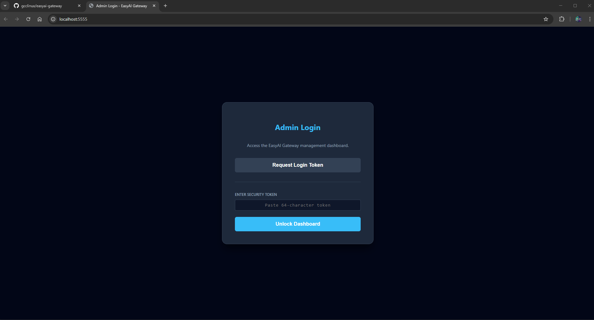
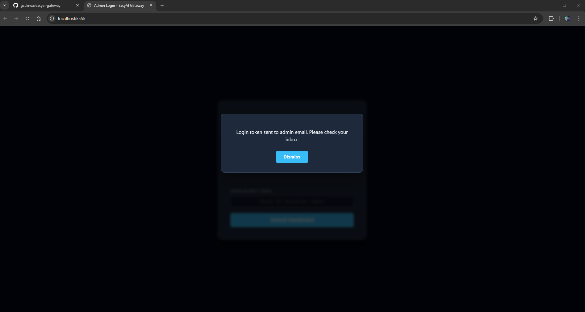
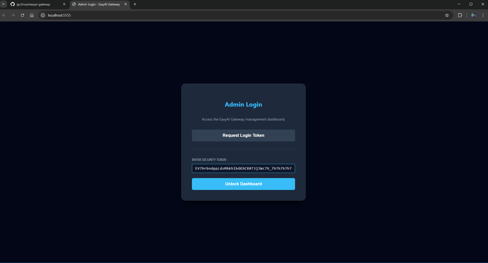
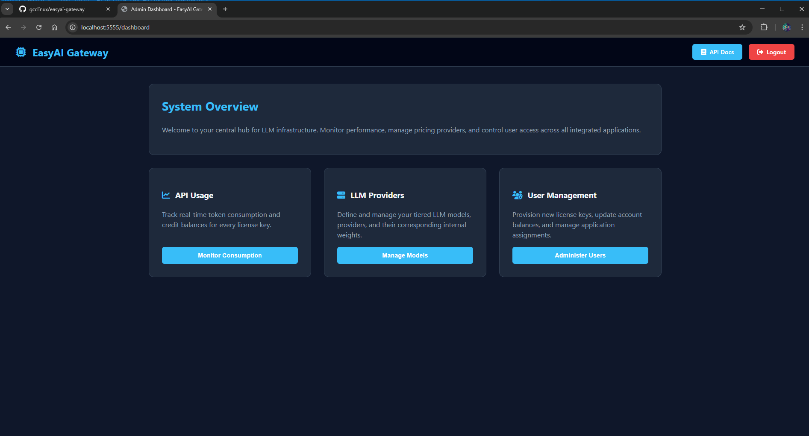
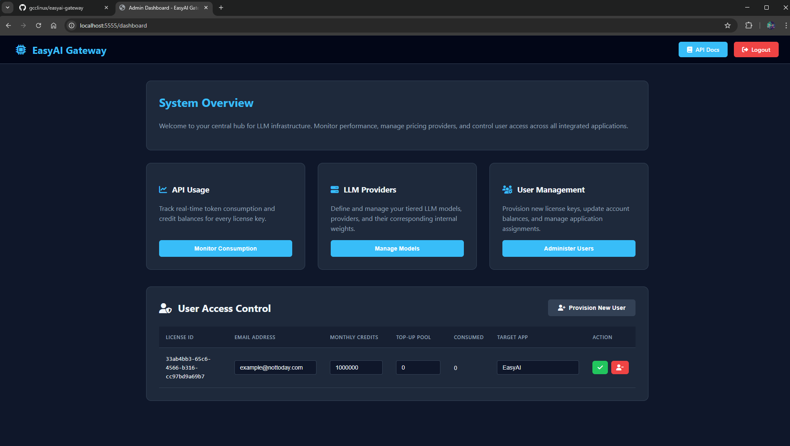
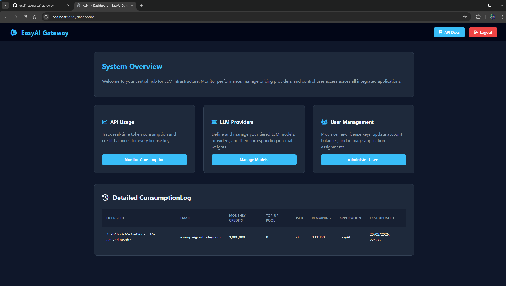
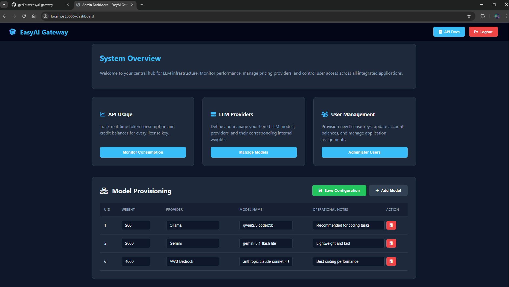
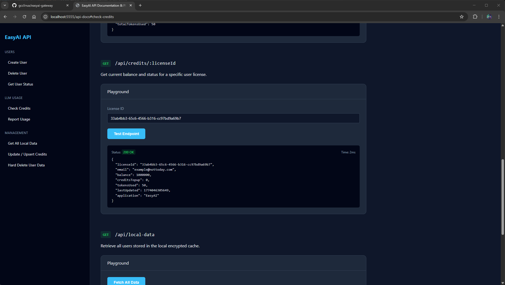
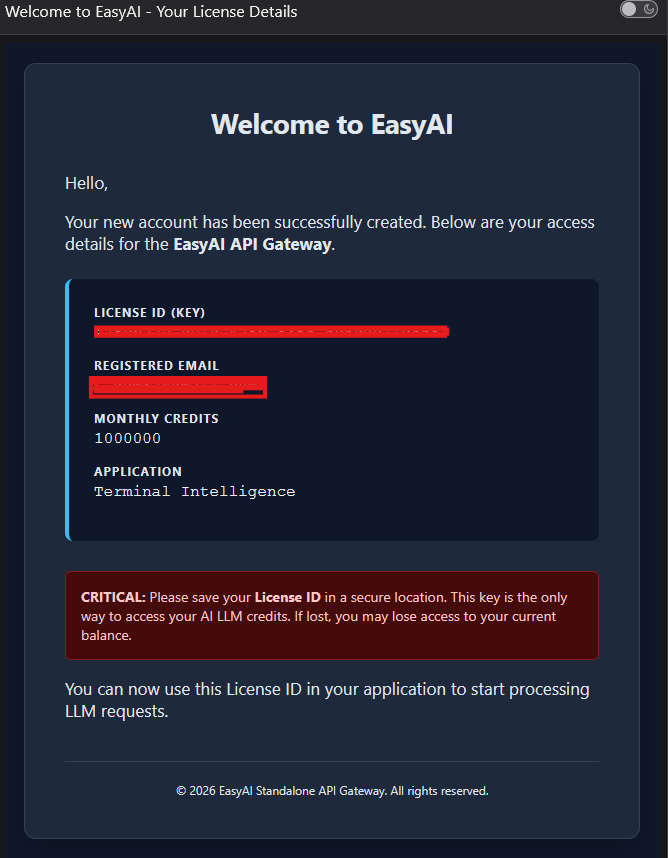

# EasyAI API Server

This project is a Go-based management server for EasyEditor Premium, integrating with local encrypted storage to manage license data, user credits, and token consumption tracking. Built with [Gin](https://github.com/gin-gonic/gin), it provides an admin dashboard, API playground, and a full REST API for external app integration.

## Prerequisites

- **Go**: Version 1.21 or higher.
- **Gmail Account**: A Gmail account with an [App Password](https://support.google.com/accounts/answer/185833) for sending login tokens and welcome emails via SMTP.

- **Environment Configuration**: Create a `.env.local` file in the project root with the following variables:
  ```env
  GMAIL_USER=your-email@gmail.com
  GMAIL_PASS=your-app-password
  ADMIN_EMAIL=admin-email@gmail.com
  SERVER_PORT=5555
  PRIME_KEY=xxxxxx-xxxxxx-xxxxxx-xxxxxx
  ```

  | Variable | Description |
  |---|---|
  | `GMAIL_USER` | Gmail address used to send emails (login tokens, welcome emails) |
  | `GMAIL_PASS` | Gmail App Password (not your regular password) |
  | `ADMIN_EMAIL` | The admin email that receives login tokens |
  | `SERVER_PORT` | Port the server listens on (defaults to `8080`) |
  | `PRIME_KEY` | Master API key used to authenticate all API requests via `X-API-Key` header |

## Authentication

The admin dashboard uses a passwordless email-based login flow:

1. The admin visits `/` and clicks "Request Login Token".
2. A one-time token is generated and emailed to the configured `ADMIN_EMAIL`.
3. The admin enters the token to authenticate and is redirected to `/dashboard`.
4. Tokens expire after 10 minutes and are single-use.

All API endpoints under `/api/*` are protected by the `X-API-Key` header, which must match the `PRIME_KEY` from your environment configuration.

## Running the Project

1.  **Install dependencies**:
    ```bash
    go mod tidy
    ```
2.  **Build the application**:
    ```bash
    go build .
    ```
3.  **Run the server**:
    ```bash
    go run .
    ```
    The server will start on `0.0.0.0:<SERVER_PORT>` (defaults to `8080` if not set).

## Project Structure

```
├── main.go              # Server entry point, routes, and API handlers
├── email.go             # Email sending (login tokens, welcome emails) and token management
├── crypto_utils.go      # AES-GCM encryption/decryption for local data storage
├── .env.local           # Environment variables (not committed)
├── .local/              # Encrypted local data cache
├── static/css/          # Dashboard stylesheets
├── templates/           # HTML templates (login, dashboard, API docs, emails)
└── docs/                # External integration guide
```

## Dashboard Features

Access the admin dashboard at `/dashboard` after logging in. It provides a UI to:

- View all registered users and their credit balances
- Create new users (auto-generates a license ID or accepts a custom one)
- Update user credits and top-up amounts
- Delete users
- Monitor token consumption per user

## API Docs & Playground

Visit `/api-docs` for an interactive API documentation page. It comes pre-filled with your `PRIME_KEY` and lets you test all endpoints directly from the browser.

## API Endpoints

All endpoints require the `X-API-Key` header.

| Method | Endpoint | Description |
|---|---|---|
| `GET` | `/api/local-data` | List all users and credit data |
| `GET` | `/api/credits/:licenseId` | Get credits for a specific user |
| `POST` | `/api/check-credits` | Check if a user has enough tokens |
| `POST` | `/api/report-usage` | Report token usage after an LLM call |
| `POST` | `/api/update-credits` | Update a user's credit balance |
| `POST` | `/api/create-user` | Create a new user with a license |
| `POST` | `/api/delete-user` | Delete a user (requires licenseId + email) |
| `DELETE` | `/api/delete-credits/:licenseId` | Remove a user by license ID |

For detailed integration instructions with curl and PowerShell examples, see the [External App Guide](docs/EXTERNAL_APP_GUIDE.md).

## Data Storage

This server is 100% standalone with no external database dependencies.

- User data is stored locally in `.local/credits_cache.json.enc`
- Data is encrypted at rest using AES-GCM
- No user data leaves your server

## Screenshots

### Admin Login
The passwordless login page where the admin requests a one-time token via email.



### Login Token Entry
The token input step where the admin pastes the token received by email.



### Login Confirmation
Confirmation screen after a successful token submission.



### Admin Dashboard
The main dashboard showing all registered users, their credits, and management actions.



### User Dashboard
A detailed view of an individual user's credit balance and token usage.



### Token Consumption
A view showing token consumption details and usage tracking per user.



### LLM Dashboard
The LLM-specific dashboard for monitoring AI model usage and token metrics.



### API Endpoint Testing
The interactive API docs playground for testing endpoints directly in the browser.



### Email Notification Example
A sample of the welcome email sent to new users with their license details.


